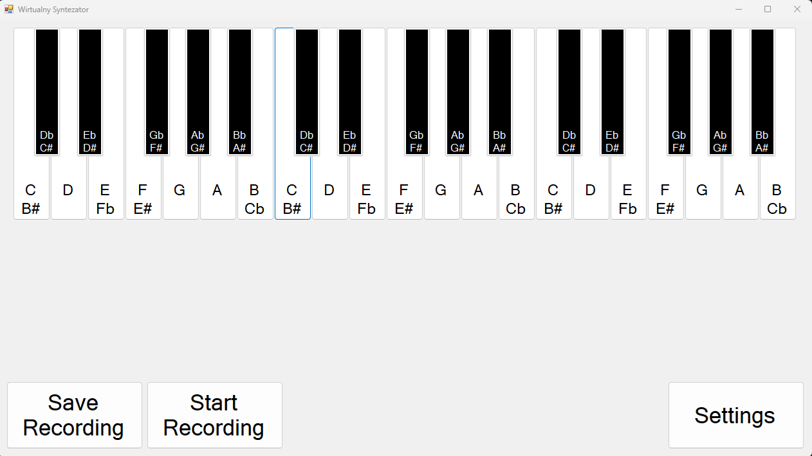
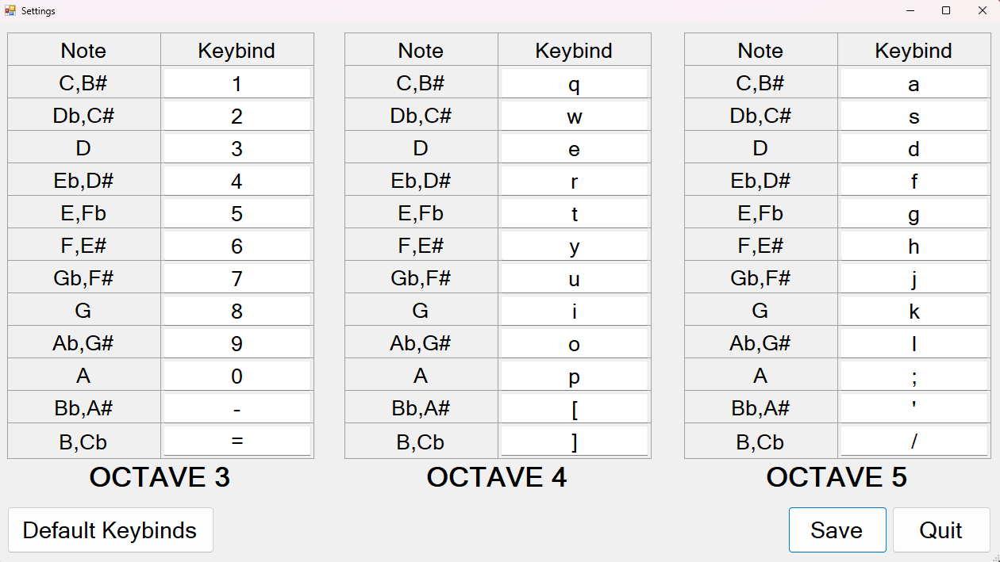

# 🎹 Virtual Synthesizer (MIDI Keyboard Emulator)

A simple project written in **C++ (Visual Studio 2022)** that works as a virtual MIDI keyboard.  
The program allows you to play sounds using your computer keyboard, record melodies, and save them in **.mid** format. A simple GUI is implemented using **.NET**.


## ✨ Features
- 🎵 Play sounds using the PC keyboard  
- 🎤 Record your own melodies  
- 💾 Export recordings to **MIDI (.mid)** files
- ⌨️ Customize key mappings (assign different keys for different notes)  
- 🖥 Simple graphical interface built with **.NET**


## 🚀 How to Run
1. Clone the repository:
   ```bash
   git clone https://github.com/Fenisk/Virtual-Synthesizer.git
   ```
2. Open the project in Microsoft Visual Studio 2022 (VirtualSynthesizer.sln).
3. Build and run the application.
4. Use your keyboard or click on notes to play.


## 🛠 Technologies
- C++17
- Microsoft Visual Studio 2022
- .NET for GUI
- Standard C++ libraries


## 📄 License
This project is released under the MIT License, allowing anyone to freely use, modify, and distribute it.


## 📸 Screenshots

*Main program window*


*Key mapping configuration window*


